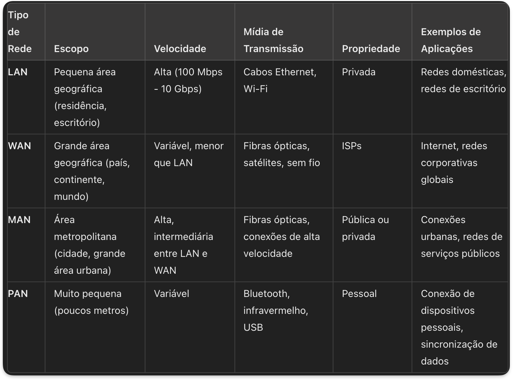

# Comparação dos Tipos de Redes

## Conclusão

Compreender os diferentes tipos de redes de computadores é crucial para projetar e implementar soluções de rede adequadas às necessidades específicas de cada contexto. Cada tipo de rede possui características e aplicações únicas que atendem a diferentes requisitos de escala, velocidade e gerenciamento.
